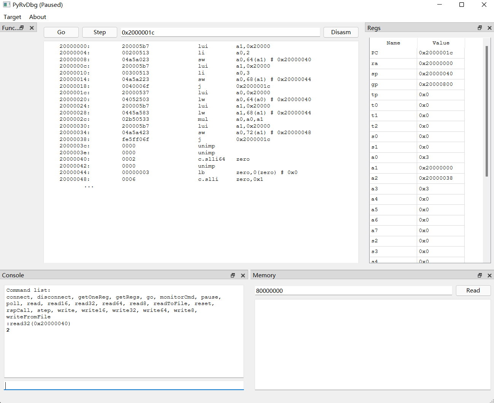

# PyRvDbg

Python-based RISC-V debugger for bare-metal devices.

Tested on VexRiscv, may work on other chips.

# Dependencies
1. Python 3.9+
2. PySide6
3. https://github.com/SpinalHDL/openocd_riscv
4. riscv64-unknown-elf-objdump, for disassembling RISC-V code.

Prebuilt binaries for windows are available at `bin` directory.

# Get Started
1. Clone the repository, install the dependencies by running `pip3 install -r requirements.txt`.
2. Run `main.py` to start the debugger.
3. You can choose to start a new OpenOCD session, or connect to an existing one. 
4. If you want to start a new session, create `init.tcl` file to configure for your target(you may find examples in `examples` directory). 